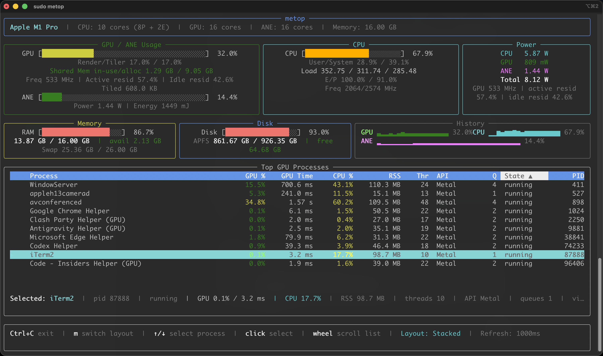

# metop

A Python-based GPU/ANE monitoring tool for Apple Silicon Macs. Like `nvtop` or `nvidia-smi`, but for Metal and the Neural Engine.

## Features

- **GPU Monitoring** (no sudo required)
  - Device, Renderer, and Tiler utilization percentage
  - GPU shared memory usage (in-use vs allocated)
  - Top GPU-active processes from AGX user client GPU time deltas
  - Selectable process list with keyboard and mouse-wheel scrolling
  - Real-time sparkline history

- **System Monitoring**
  - CPU usage and load average
  - Memory usage and swap
  - Disk usage and read/write throughput

- **ANE + Power Metrics** (requires sudo / `powermetrics`)
  - CPU/GPU/ANE/Total power (mW/W)
  - GPU/ANE frequency and active/idle residency (when available)
  - ANE utilization estimated from residency (fallback: power-based)

- **Display Modes**
  - Default stacked layout: top for GPU+ANE, CPU, and power; middle for memory, disk, and history; bottom for top GPU processes
  - Runtime switching with `m` (`1` for stacked, `2` for classic)

- **System Info**
  - Chip detection (M1/M2/M3/M4 series)
  - CPU/GPU/ANE core counts
  - Total memory

## Installation

```bash
# Install from source
pip install -e .

# Or with optional fast IOKit bindings
pip install -e ".[fast]"
```

## Usage

```bash
# Basic monitoring (GPU only)
metop

# Enable ANE + power metrics (requires sudo)
sudo metop

# Custom refresh interval (500ms)
metop -i 500

# Disable ANE/powermetrics even with sudo
metop --no-ane

# Start in the classic layout
metop --layout classic

# Debug mode (single sample, raw output)
metop --debug
```

## ANE Load Test

If you want to verify that the ANE panel is reacting to a real Core ML workload,
you can run the helper script below in one terminal and `metop` in another:

```bash
# Terminal 1: create sustained Core ML inference load
swift scripts/ane_stress.swift --seconds 30 --workers 4

# Terminal 2: watch ANE metrics
sudo metop -i 500
```

The script uses a tiny bundled Core ML model in
`resources/models/tiny_ane_stress.mlmodel`, requests `CPU + Neural Engine`
execution by default, and loops inference long enough to make ANE activity
visible in `powermetrics` without downloading a large external model.

Important: Apple does not expose a public API to drive the ANE directly. The
actual placement is still decided by Core ML based on model/operator support, so
unsupported parts can fall back to CPU.

## Screenshot



## How It Works

### GPU Monitoring
Uses `IOKit` via `ioreg` command to query the `AGXAccelerator` driver's `PerformanceStatistics`. This provides:
- `Device Utilization %` - Overall GPU busy percentage
- `Renderer Utilization %` - Shader/compute units
- `Tiler Utilization %` - Geometry processing
- `Shared Mem in-use/alloc` - AGX shared system memory currently in use versus memory allocated/reserved by the GPU driver. This is not total system RAM and not discrete VRAM.
- Per-process GPU activity by diffing each AGX user client's `accumulatedGPUTime`

Per-process activity is reported as GPU time over the sample window, normalized
into an estimated percentage. This is a best-effort approximation, not a direct
hardware residency counter.

### ANE + Power Metrics
Uses `powermetrics` (`-f plist`) to collect CPU/GPU/ANE power and residency/frequency data. Requires `sudo` because `powermetrics` needs root access.

In the GPU / ANE panel:
- `Freq` is the accelerator clock frequency reported by `powermetrics` when available.
- `Active resid` / `Idle resid` are residency percentages over the sample window. They describe how long the accelerator stayed active or idle, and are not the same thing as the direct GPU utilization bar from `ioreg`.

ANE utilization is estimated from:
- preferred: ANE active residency reported by `powermetrics`
- fallback: power-based estimate

```
utilization = (current_power / max_power) * 100%
```

## Requirements

- macOS Monterey (12.0) or later
- Apple Silicon Mac (M1/M2/M3/M4 series)
- Python 3.9+
- `rich` (terminal UI)
- `psutil` (memory stats)

## License

MIT License
